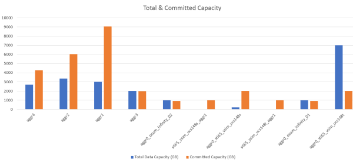

= 创建报告以显示聚合容量表和图表
:icons: font
:imagesdir: ../media/

[role="lead"]
您可以使用总计和集群模式列图表格式创建报告来分析 Excel 文件中的容量。

* 您需要的内容 *

* 您必须具有应用程序管理员或存储管理员角色。

按照以下步骤打开运行状况：所有聚合视图，在 Excel 中下载此视图，创建可用容量图表，上传自定义的 Excel 文件以及计划最终报告。

.步骤
. 在左侧导航窗格中，单击 * 存储 * > * 聚合 * 。
. 选择 * 报告 * > * 下载 Excel* 。
+
image::../media/download_excel_menu.png[下载 Excel 菜单]

+
根据您的浏览器，您可能需要单击 * 确定 * 来保存文件。

. 如果需要，请单击 * 启用编辑 * 。
. 在 Excel 中，打开下载的文件。
. 创建新工作表（image:../media/excel_new_sheet_icon.png[""]）在 `data` 表后将其命名为 * 总数据容量 * 。
. 在新的总数据容量表中添加以下列：
+
.. 总数据容量（ GB ）
.. 已提交容量（ GB ）
.. 已用数据容量（ GB ）
.. 可用数据容量（ GB ）

. 在每列的第一行中，输入以下公式，确保引用数据表（ data ！），并引用正确的列和行说明符来指定所捕获数据（ Total Data Capacity 从列 E 中提取数据，第 2 到第 20 行）。
+
.. =sum （ data ！ E$2 ： data ！ E$20 ）
.. =sum （ data ！ F$2 ： data ！ F$50 ）
.. =sum （ data ！ G$2 ： data ！ G$50 ）
.. =sum （ data ！ H$2 ： data ！ H$50 ）

+
该公式将根据当前数据对每列进行汇总。

image::../media/capacitysums.png[容量总和]

. 在数据表中，选择 * 总数据容量（ GB ） * 和 * 已提交容量（ GB ） * 列。
. 从 * 插入 * 菜单中选择 * 建议的图表 * ，然后选择 * 集群列 * 图表。
. 右键单击该图表并选择 * 移动图表 * ，将该图表移动到 `总数据容量` 工作表。
. 选择图表后，您可以使用 * 设计 * 和 * 格式 * 菜单自定义图表的外观。
. 如果满意，请使用所做的更改保存文件。请勿更改文件名或位置。
+

. 在 Unified Manager 中，选择 * 报告 * > * 上传 Excel* 。
+
[NOTE]
====
确保您所处的视图与您下载 Excel 文件的视图相同。

====
. 选择已修改的 Excel 文件。
. 单击 * 打开 * 。
. 单击 * 提交 * 。
+
* 报告 * > * 上传 Excel* 菜单项旁边会显示一个复选标记。

+
image::../media/upload_excel.png[上传 Excel]

. 单击 * 已计划报告 * 。
. 单击 * 添加计划 * 向报告计划页面添加新行，以便为新报告定义计划特征。
+
[NOTE]
====
选择报告的 * XLSX* 格式。

====
. 输入报告计划的名称并填写其他报告字段，然后单击复选标记（image:../media/blue_check.gif[""]）。
+
报告将立即作为测试发送。之后，报告将生成，并以指定频率通过电子邮件发送给列出的收件人。

根据报告中显示的结果，您可能需要调查如何在整个网络中以最佳方式使用可用容量。
