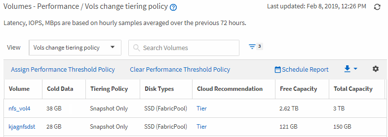

= 创建报告以确定 FabricPool 聚合上应将数据移至云层的卷
:allow-uri-read: 
:icons: font
:imagesdir: ../media/

[role="lead"]
您可以创建一个报告，其中包含当前驻留在 FabricPool 聚合上，具有 " 层 " 云建议以及具有大量冷数据的卷的列表。此报告可帮助您确定是否应将某些卷的分层策略更改为 "`auto` " 或 "`all` " ，以便将更多冷数据（非活动数据）卸载到云层。

* 您需要的内容 *

* 您必须具有应用程序管理员或存储管理员角色。
* 您必须已配置 FabricPool 聚合并在这些聚合上具有卷。

按照以下步骤创建一个自定义视图，以正确顺序显示所需列，然后计划为此视图生成报告。

.步骤
. 在左侧导航窗格中，单击 * 存储 * > * 卷 * 。
. 在视图菜单中，选择 * 性能 * > * 所有卷 * 。
. 在列选择器中，确保视图中显示 `Disk Type` 列。
+
添加或删除其他列以创建对您的报告重要的视图。

. 将 " `D` 类型`" 列拖放到 "` 云建议 " 列附近。
. 单击筛选器图标，添加以下三个筛选器，然后单击 * 应用筛选器 * ：
+
** 磁盘类型包含 FabricPool
** 云建议包含层
** 冷数据大于 10 GBimage:../media/filter_cold_data.gif[""]

. 单击冷数据列的顶部，以使冷数据最多的卷显示在视图的顶部。
. 使用名称保存此视图以反映此视图显示的内容，例如 "`Vols change tiering policy` " 。
. 单击清单页面上的 * 已计划报告 * 按钮。
. 单击 * 添加计划 * 向报告计划页面添加新行，以便为新报告定义计划特征。
. 输入报告计划的名称并填写其他报告字段，然后单击复选标记（image:../media/blue_check.gif[""]）。
+
报告将立即作为测试发送。之后，报告将生成，并以指定频率通过电子邮件发送给列出的收件人。

根据报告中显示的结果，您可能希望使用 System Manager 或 ONTAP 命令行界面将某些卷的分层策略更改为 "`auto` " 或 "`all` " ，以便将更多冷数据卸载到云层。
